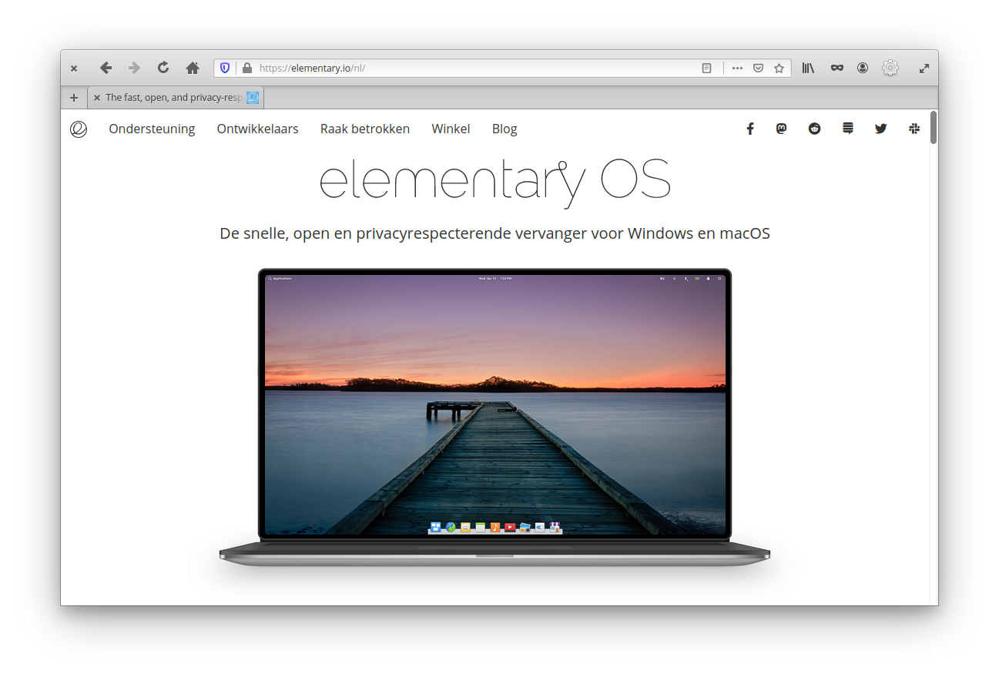
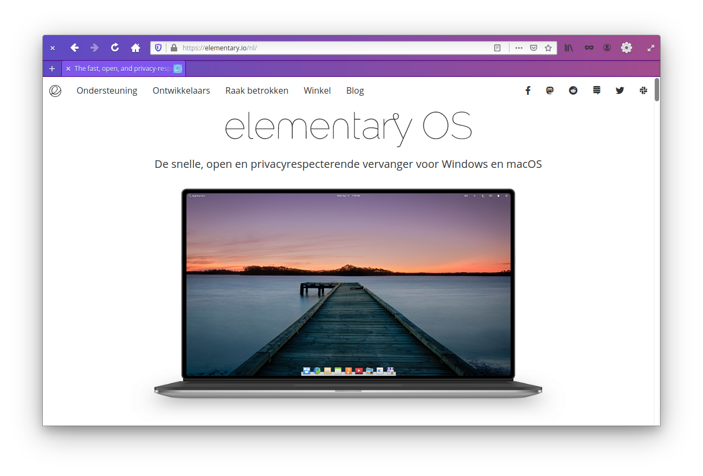

# An elementary os theme for Firefox





## Credits

Credits to [Harvey Cabaguio](https://github.com/harveycabaguio/firefox-elementary-theme) for setting the theme up, [h1royuki](https://github.com/h1royuki/firefox-elementary-theme) for the dark mode and the elementary team for the UI design and icons.

## Install

**Firefox does not support userChrome.css by default. Here are the steps to make it work:**

  1. Load **about:config** in the Firefox address bar.
  2. Confirm that you will be careful.
  3. Search for `toolkit.legacyUserProfileCustomizations.stylesheets` using the search at the top.
  4. Toggle the preference by double clicking. True means Firefox supports the CSS files, False that it ignores them.

**Follow these steps to install the userChrome.css with elementary buttons layout:**

Use one line install script

```bash
curl -s -o- https://raw.githubusercontent.com/Zonnev/elementaryos-firefox-theme/master/install.sh | bash
```

Or

  1. Load **about:support** in the Firefox address bar.
  2. Application Basics > Profile Directory > Open Directory
  3. Create a folder named `chrome`
  4. Paste the `userChrome.css` in this folder
  
## After installation

1. Disable Title bar in the customization panel in Firefox. 
2. In the customization panel in Firefox you can move the new tab button to the left if you wish and use the dark mode option as well, in combination with [Tweaks](https://github.com/elementary-tweaks/elementary-tweaks).

## Install a window control button layout

1. Download the master zip file.
2. Click on `elementaryos-firefox-theme-master.zip` and choose a `userChrome.css` in the folder that shows the button layout you like.
3. Unzip to the `.mozilla/firefox/{your profile folder}/chrome/` directory. Use `ctrl+h` to see the `.mozilla` folder in your `Personal folder`. If there is no `chrome` folder, create it and unzip your chosen `userChrome.css` to it.
